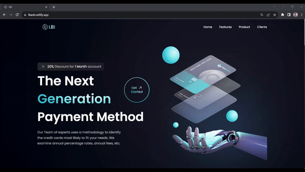

# LBANK - Bank Landing Page

[LBANK](https://lbank.netlify.app/) is a landing page project for a bank, built using Tailwind CSS, React, and Vite.



## Table of Contents
- [Introduction](#introduction)
- [Features](#features)
- [Demo](#demo)
- [Getting Started](#getting-started)
- [Usage](#usage)
- [Contributing](#contributing)
- [Contact](#contact)

## Introduction

LBANK is a landing page designed for a bank, aimed at showcasing the bank's services and offerings. This project utilizes Tailwind CSS for creating responsive and stylish layouts, React for building interactive user interfaces, and Vite for a fast development workflow.

## Features

- Responsive design using Tailwind CSS classes.
- Clear presentation of bank services.
- Modern UI components powered by React.
- Efficient development process with Vite.

## Demo

Visit the live demo: [LBANK - Basic Bank Landing Page](https://lbank.netlify.app/)

## Getting Started

To run the project locally, follow these steps:

### Prerequisites

- Node.js: Make sure you have Node.js installed. You can download it from [https://nodejs.org/](https://nodejs.org/).

### Installation

1. Clone the repository:

```bash
git clone https://github.com/lokesh-bhortake/lbank.git
```

2. Navigate to the project directory:
```bash
cd lbank
```

3. Install dependancies
```bash
npm install
```

## Usage

1. Start the development server:

```bash
npm run dev
```

2. Press ctrl/cmd + click on the link displayed in the terminal.

## Contributing

We welcome contributions to the FitFlex Gym Website project! To contribute, follow these steps:
1. Fork the repository and clone it to your local machine.
2. Create a new branch for your feature or bug fix.
3. Make your changes, commit them, and push to your fork.
4. Submit a pull request detailing your changes.


## Contact

For any questions, concerns, or collaboration inquiries, feel free to reach out to us:

- Email: lb5102001@gmail.com
- LinkedIn: [Lokesh Bhortake](https://www.linkedin.com/in/lokesh-bhortake/)

I appreciate your interest in LBANK - Bank Landing Page! Your feedback and contributions are valuable to me.
